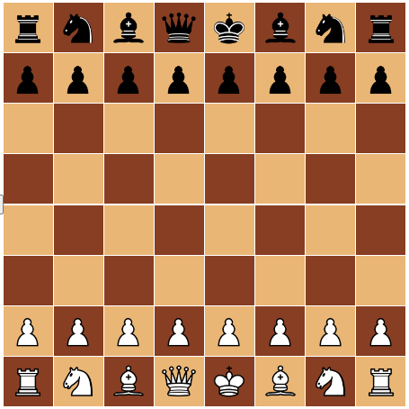

<!-- PROJECT LOGO -->

<br />
<div align="center">
  <!-- <a href="https://github.com/github_username/repo_name"> -->
    
  <!-- </a> -->

<h3 align="center">My Chess - Typescript</h3>

  <p align="center">
    My challenge of developing a chess board.
    <br />
    <a href="https://github.com/valioprea/myChess-Typescript/wiki"><strong>Explore the docs (wiki) »</strong></a>
    <br />
    <br />
    <!-- <a href="https://github.com/github_username/repo_name">View Demo</a>
    ·
    <a href="https://github.com/github_username/repo_name/issues">Report Bug</a>
    ·
    <a href="https://github.com/github_username/repo_name/issues">Request Feature</a> -->
  </p>
</div>

<!-- TABLE OF CONTENTS -->
  <summary>Table of Contents</summary>
  <ol>
    <li>
      <a href="#about-the-project">About The Project</a>
      <ul>
        <li><a href="#built-with">Built With</a></li>
      </ul>
    </li>
    <li>
      <a href="#getting-started">Getting Started</a>
      <ul>
        <li><a href="#installation">Installation</a></li>
        <li><a href="#prerequisites">Prerequisites</a></li>
      </ul>
    </li>
    <li><a href="#usage">Usage</a></li>
    <li><a href="#roadmap">Roadmap</a></li>
    <li><a href="#contributing">Contributing</a></li>
<!--     <li><a href="#license">License</a></li> -->
    <li><a href="#contact">Contact</a></li>
    <li><a href="#acknowledgments">Acknowledgments</a></li>
  </ol>

<!-- About the project -->
## About The Project
<div align="center">
  <!-- <a href="https://github.com/github_username/repo_name"> -->
    
  <!-- </a> -->
</div>

About the project, a little bit about myself. 
Wanting to grasp solid knowledge of algorithmics, data structures, OOP and SOLID principles I thought that one of the best ways to start learning theoretical programming principles is to actually start programming a chess board.

From a holistic perspective, this project encompasses many major areas of web development and data structures & algorithms such as:
* Front end development
* Back end development
* Web protocols - REST API & WebSockets
* Algorithms, data structures, data interaction
* And so many more!

Many many things are still yet to be implemented but the road is long and I worked on this mostly myself. I had some help on the FE side of things to be able to touch pieces and select them and a little bit of help with the websocket used to communicate with the back end.

### Built With
* HTML
* CSS
* Javascript
* Typescript
* Express JS
* Socket.IO

<!-- GETTING STARTED -->
## Getting Started

### Installation

To get a local copy on your machine, it's easy - just two steps!
1. Installation Step:
* npm
  ```sh
  npm install 
  npm run dev
  ```
2. Accessing Step: <br>
Go to http://localhost:3000/home <br>
Press ''Click me to play'' button <br>
You will be redirected to http://localhost:3000/play <br>
Press ''START'' button <br>
Enjoy! <br>

### Prerequisites
You need to have node already installed on your machine.
If you don't have it just go to -> https://nodejs.org/en/

<!-- USAGE EXAMPLES -->
## Usage

Until now, the main focus was developing the whole logic of the board and chess rules. <br>
The UI needs massive improvement and the player will be constricted to use the app in a manner that it won't break from the FE.

- the pieces need ONLY to be dragged and after that dropped on the marked squares
- DON'T: click a piece and then a target square. As above, just drag it.
- try to respect the white / black alternating moves. On BE still some validations need to be made but on the FE there is no stopping at the moment.

<!-- ROADMAP -->
## Roadmap

As trivia, I actually started developing the app using Java. My intention was to build a GUI that will later be supported by a Spring Boot application to turn to the web side of things. Unfortunately I have met many obstacles on the road and decided to switch to typescript and have the same language for both the logic and the UI - which now is javascript. <br>
<br>

The repo with how things were left off with the java app can be viewed here: https://github.com/valioprea/chessGame
<br>
I hope that someday I will make the whole development story available on the wiki page just for fun and maybe future developers who read this will avoid certain obstacles that I confronted.
<br>

As previously stated, many things have yet to be implemented but I am happy that I can say I have a functional board with almost all the rules implemented and I am not really sure what is prioritary next. I will just list some things that I've done, and some others that I intend to do in the future.
<br>

- [x] Create computing functions
- [x] Link computing functions to checkmate algorithm
- [x] Define UI
- [x] Link UI with backend through socket, encompassed by an express server
- [x] Solo play capability
- [ ] Create socket room
- [ ] Define players
- [ ] Explore how players interact in the same room with the same board
- [ ] Deploy
- [ ] Test out links to friends
- [ ] Wiki pages of this repo
- [ ] And many more, so ...stay tuned!


<!-- CONTRIBUTING -->
## Contributing

I know that I probably don't know what's wrong in some places, but I'm more afraid of what I don't know that I don't know. Everyday I try to become a better developer. I am absolutely sure that many experienced developers will have lots of things to say about this code but please consider this is my first project of this complexity, build on my own. As such, any contributions that you have ... a comment, a small improvement, maybe an algorithmic flaw that I didn't see - will be **greately appreciated**.
<br>

If you have a suggestion that would make this better, please fork the repo and create a pull request. You can also simply open an issue.
<br>
If you feel like this deserves anything ... give it a star! Everybody loves stars, right ?

<br>
Contributing:
<br>

1. Fork the Project
2. Create your Feature Branch (`git checkout -b feature/AmazingFeature`)
3. Commit your Changes (`git commit -m 'Add some AmazingFeature'`)
4. Push to the Branch (`git push origin feature/AmazingFeature`)
5. Open a Pull Request

<!-- CONTACT -->
## Contact

I am a sociable person and I love writing code. For any suggestions, or collaborative ideas please feel free to reach out:

Valentin Oprea - [@linkedin](https://www.linkedin.com/in/valioprea/) - aeroprea@gmail.com

Project Link: [https://github.com/valioprea/myChess-Typescript)

<!-- ACKNOWLEDGMENTS -->
## Acknowledgments

Many thanks in the first place for the guys that helped me on the road.<br>
- Help received at the front end by [AlexTudosoiu](https://github.com/samothui)
- Help received at the socket.io stuff by [DanielBradea](https://github.com/danielbradea)
<br>
A big big thank you as well for my other friends with which I spent some good hours brainstorming this and that regarding algorithms and solutions.
<br>

And also I would like to thank the creator of the cloning package, it literally saved this app and made it functional. <br>
https://www.npmjs.com/package/lodash

Last but not least, kudos to the person who inspired me with this mega cool readme page:
<br>
https://github.com/othneildrew/Best-README-Template

